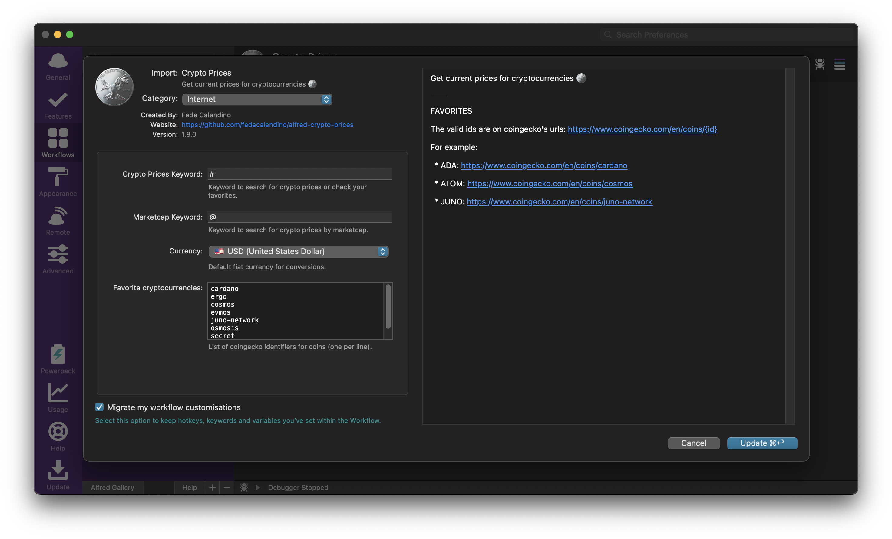
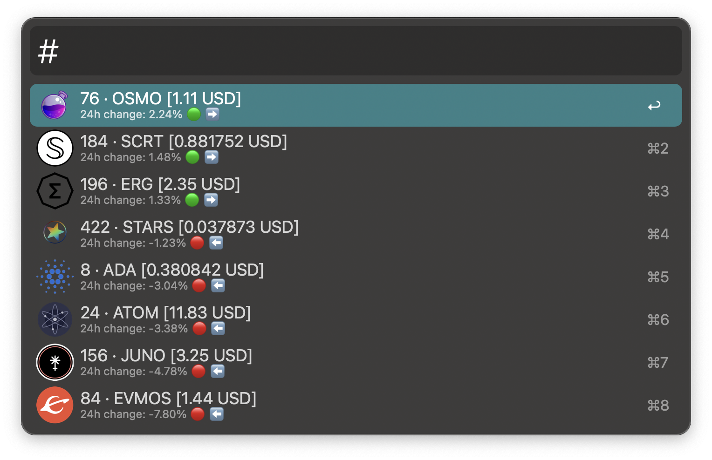
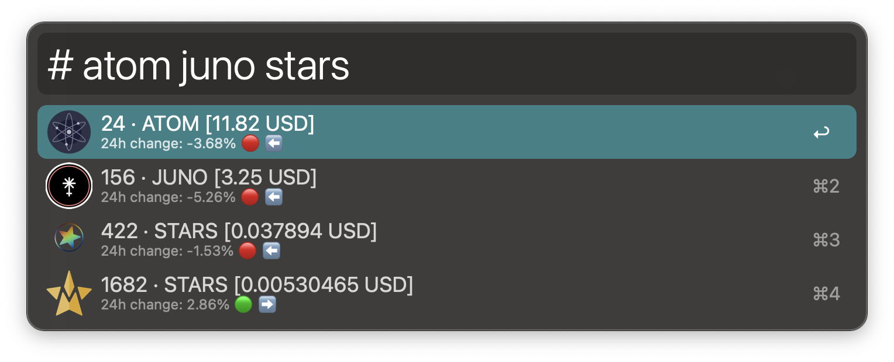
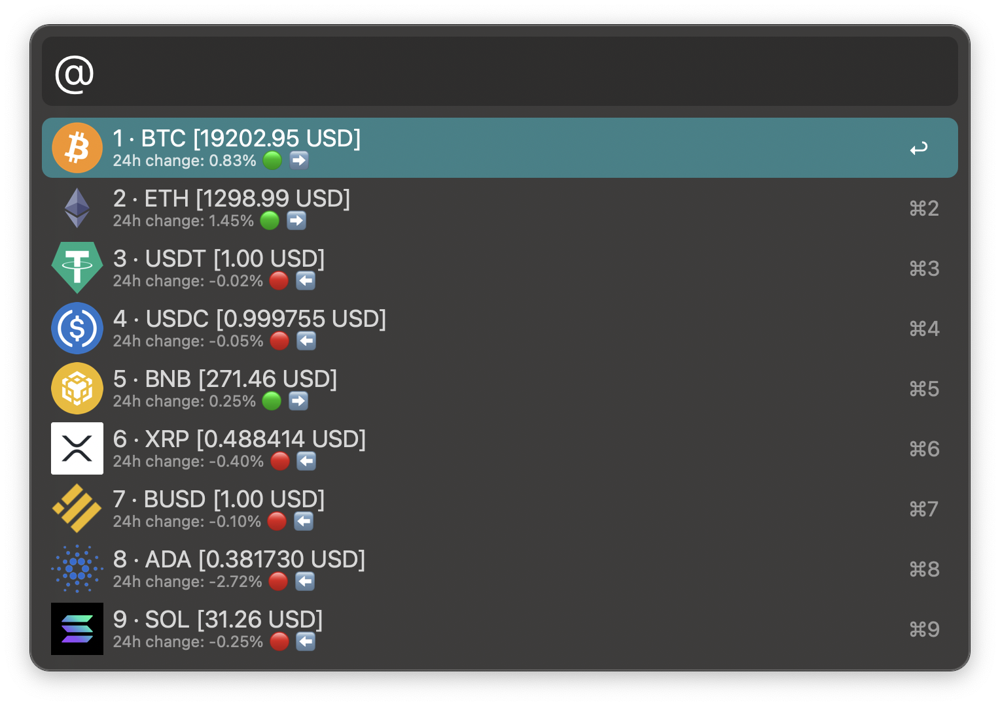

## ALFRED-CRYPTO-PRICES

[Alfred Workflow](https://www.alfredapp.com/workflows/) to get current prices for cryptocurrencies 🪙️

#### Configuration:

FAVORITES

The valid ids are on coingecko's urls: https://www.coingecko.com/en/coins/{id}

For example:

  * ADA: https://www.coingecko.com/en/coins/cardano
  * ATOM: https://www.coingecko.com/en/coins/cosmos
  * JUNO: https://www.coingecko.com/en/coins/juno-network

#### Usage:

##### • favorites (from configuration)

##### • search

> note: the search works over the symbol of a coin, not its id.

##### • marketcap

