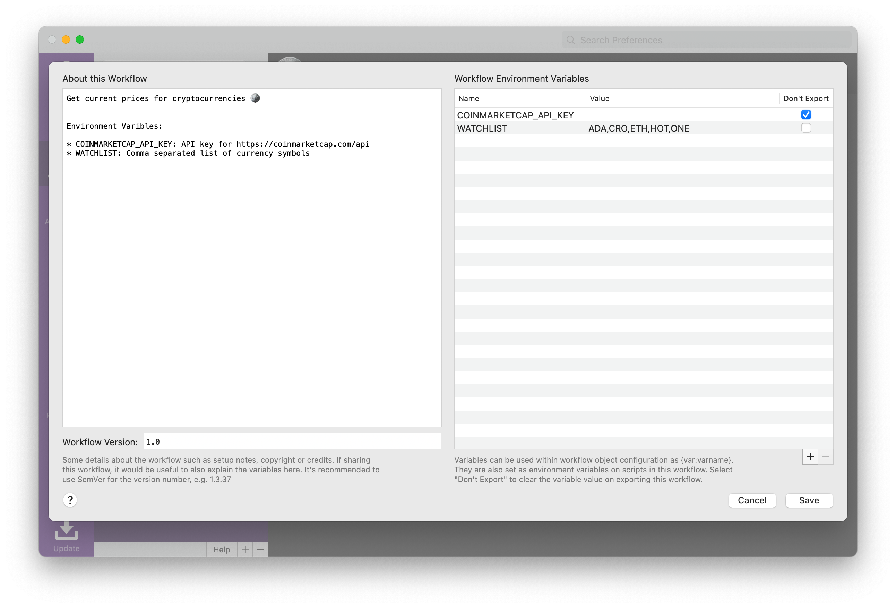
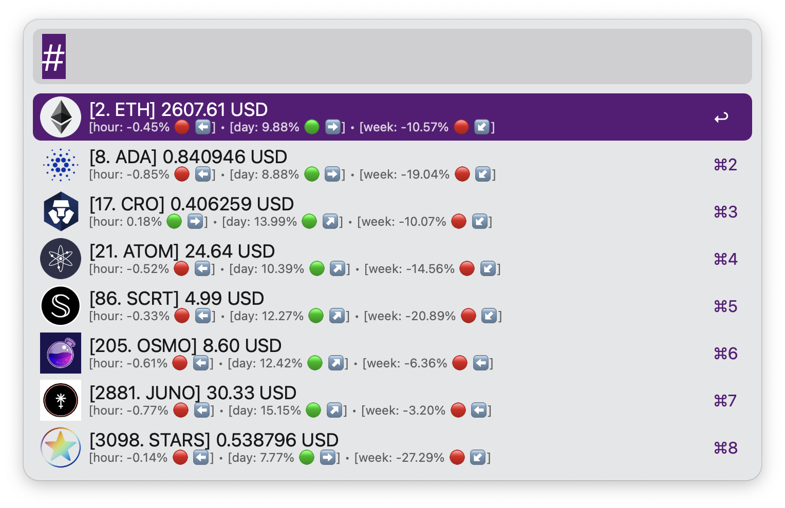

## ALFRED-CRYPTO-PRICES

[Alfred Workflow](https://www.alfredapp.com/workflows/) to get current prices for cryptocurrencies 🪙️

#### set Up:

Environment Variables:

* **COINMARKETCAP_API_KEY**: API key for https://coinmarketcap.com/api
* **WATCHLIST**: Comma separated list of coinmarketcap currency slugs

#### usage:

A mix of slugs and symbols can be used both in the search or in the watchlist:

For example:

  * ADA (symbol) / cardano (slug)
  * ATOM (symbol) / cosmos (slug)
  * ETC (symbol) / ethereum-classic (slug)

The slugs have to the ones used by coinmarketcap.com, and can be found in the url of each currency:

  * https://coinmarketcap.com/currencies/**cardano**/
  * https://coinmarketcap.com/currencies/**cosmos**/
  * https://coinmarketcap.com/currencies/**ethereum-classic**/

This is to allow search for multiple coins that have the same symbol:

  * STARS / mogul-productions
  * STARS / stargaze
  * STARS / starlaunch

> note: results will be always sorted by marketcap rank.

##### • watchlist (from WATCHLIST variable)

##### • search

##### • marketcap

