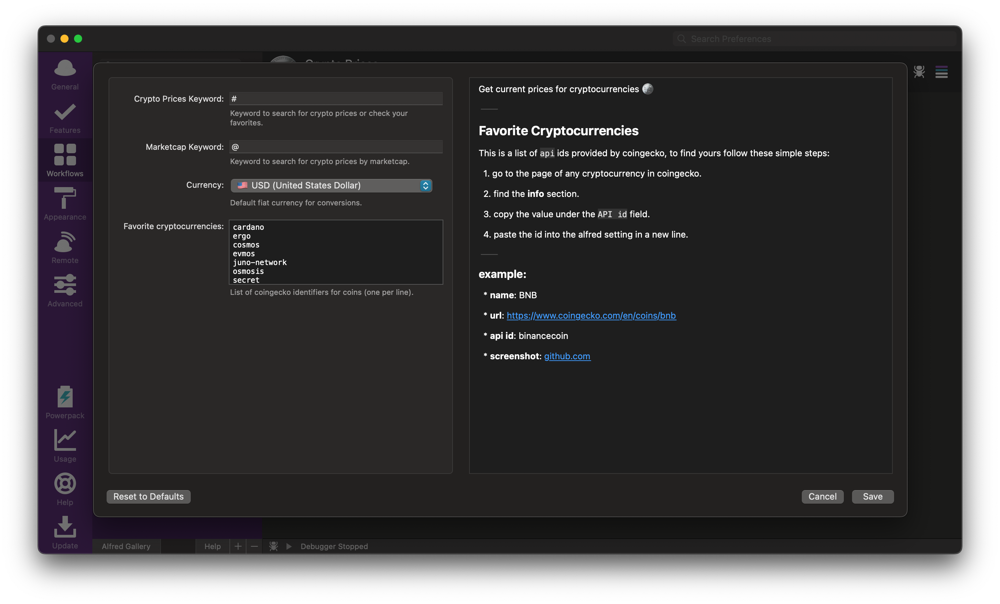

## ALFRED-CRYPTO-PRICES

[Alfred Workflow](https://www.alfredapp.com/workflows/) to get current prices for cryptocurrencies 🪙️

#### Configuration:

##### Favorite cryptocurrencies

This is a list of `api` ids provided by coingecko, to find yours follow these simple steps:

1. go to the page of any cryptocurrency in coingecko. 
2. find the **info** section.
3. copy the value under the `API id` field.
4. paste the id into the alfred setting in a new line.

###### example:

* **name**: BNB
* **url**: https://www.coingecko.com/en/coins/bnb
* **api id**: binancecoin

#### Usage:

##### • favorites (from configuration)

> note: results are sorted by the 24 percent change.

##### • search

> note: the search works over the symbol of a coin, not its id.

##### • marketcap

